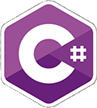
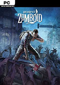
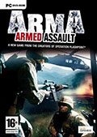
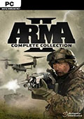
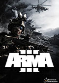
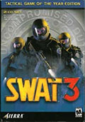
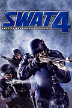

# Welcome 👋

Bienvenue sur mon Github. Centre des projets d'un passionné autidacte et faisant preuve d'une tres grande curiosité dans la programmation informatique.
Je cherche notamment à connaitre

* 🌱 I’m currently learning ...
* 👯 I’m looking to collaborate on ...

🤔 I’m looking for help with ...

💬 Ask me about ...

📫 How to reach me: ...

😄 Pronouns: ...

⚡ Fun fact: ...

# System

Je travaille sur ces OS

| WINDOWS 11 | DEBIAN |
| ---------- | ------ |
|            |        |

# Langages de programmation

j'utilise ces langages de programmation.

| C#                         | Python                    | HTML5                                                                                                                  | CSS3                                                                                                                   | JS                                                                                                                     |
| -------------------------- | ------------------------- | ---------------------------------------------------------------------------------------------------------------------- | ---------------------------------------------------------------------------------------------------------------------- | ---------------------------------------------------------------------------------------------------------------------- |
|  |  |   |   |   |

# Jeux Videos :

J'ai réalisé des Maps, Addons / utilitaires pour les jeux ci dessous sur de nombreuses années ;)

|      Project Zomboid      |                          |                        |  |
| :----------------------------: | :----------------------: | :---------------------: | - |
|  |                          |                        |  |
|       Armed Assault       |          ArmA 2          |         ArmA 3         |  |
|          |  |  |  |
|             SWAT 3             |          SWAT 4          |                        |  |
|        |  |                        |  |
